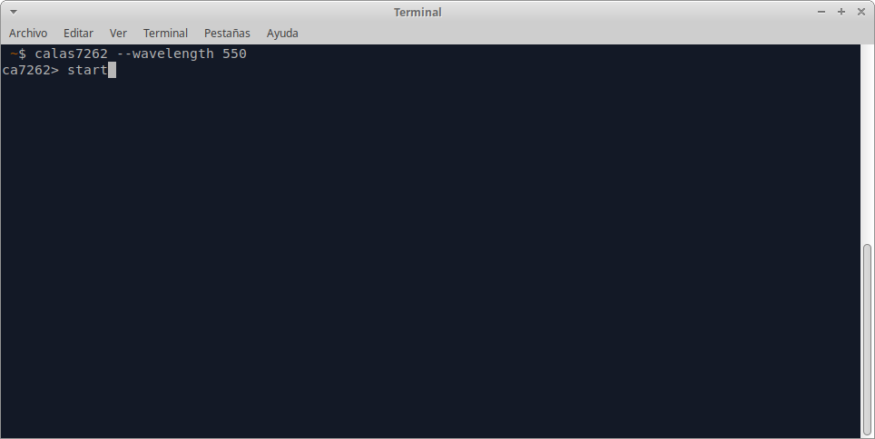
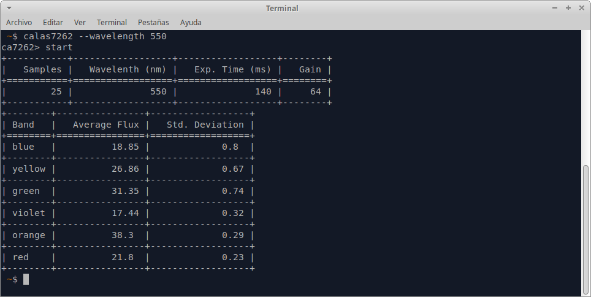

# calas7262
Command line utility to calibrate an AS7262 sensor.

## Installation

```
git clone https://github.com/astrorafael/calas7262.git
cd calas7262
sudo python setup.py install
```

## Usage

This program is a helper tool to calibrate the spectral response of the AS7262, used in `streetcolors` prototype, part of the EU-funded project ACTION.
The utility shows its usage in the command line:

```bash
 ~$ calas7262 --help
usage: calas7262 [-h] [--version] [-k] [--log-file LOG_FILE] [--log-messages]
                 [-s SIZE] -w WAVELENGTH [-l {info,debug}] [-c CSV_FILE]
                 [-p PORT] [-b {9600,115200}]

optional arguments:
  -h, --help            show this help message and exit
  --version             show program's version number and exit
  -k, --console         log to console
  --log-file LOG_FILE   log file
  --log-messages        log raw messages too
  -s SIZE, --size SIZE  how many samples to take before computing statistics
  -w WAVELENGTH, --wavelength WAVELENGTH
                        enter wavelength for CSV logging
  -l {info,debug}, --log-level {info,debug}
                        enter wavelength for CSV logging
  -c CSV_FILE, --csv-file CSV_FILE
                        statistics CSV file
  -p PORT, --port PORT  Serial Port path
  -b {9600,115200}, --baud {9600,115200}
                        Serial port baudrate
```
Most of the time, the default values are ok and the user has to supply a mandatory `wavelength` parameter, only used as a tag to identify measurements.

The default values are:
* Logging: logging to file enabled, logging to console disabled
* Log file: `calas7262.log` in your current directory
* Log level: `info`
* Sample size: 25 readings
* Serial Port: `/dev/ttyUSB0` @ 115200 baud
* CSV data file: `calas7262.log` in your current directory

Once invoked with the mandatory wavelength parameter, the tool will display a prompt after some 5-10 seconds of delay



When the prompt is ready, adjust the hardware exposure time and gain and then type `start`
After taking some readings, it will display the final staticstics as shown in the figure below:



When the stats are calculated, then enter the photodiode current in nA typing `photod`, then type `save`.
